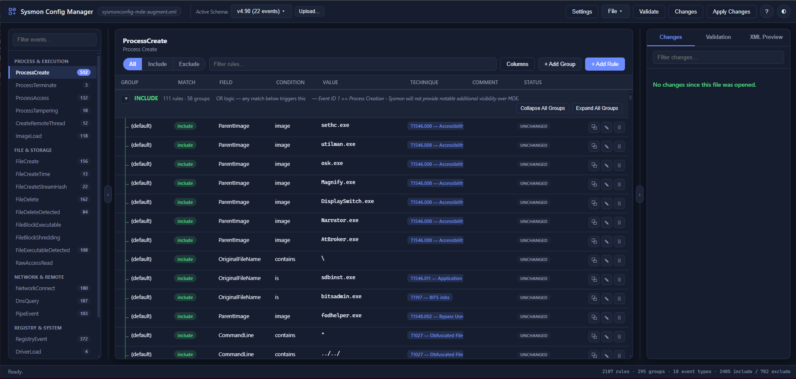
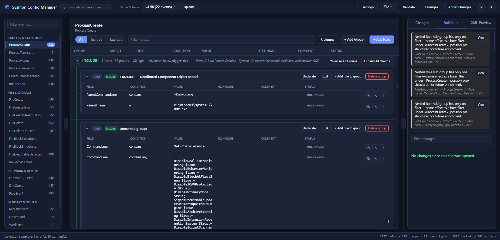
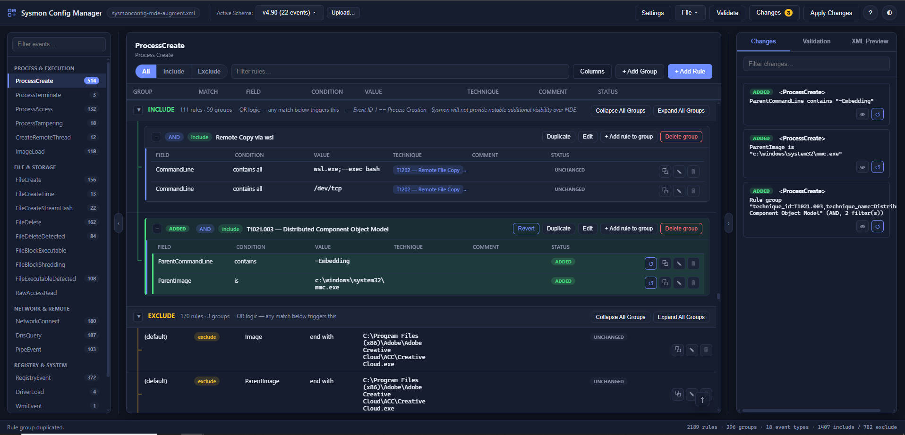
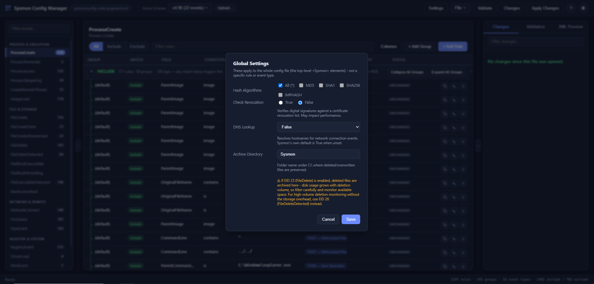

# Sysmon Config Manager (Web UI)

A browser-based UI for loading, editing, validating, and applying Sysmon XML
configuration files — Flask backend + a modern HTML/CSS/JS frontend (no
build step, no framework, just plain JS).

## Screenshots

| Rule editor | Validation |
|---|---|
|  |  |

| Change tracking | Global settings |
|---|---|
|  |  |

## Setup (WSL / Linux / macOS / Windows)

```bash
pip install -r requirements.txt
python3 server.py                          # blank config
python3 server.py path/to/config.xml       # load a config on startup
python3 server.py path/to/config.xml --host 0.0.0.0   # also reachable from other devices on your network
python3 server.py --port 5050              # use a different port
```

Then open **http://127.0.0.1:5000** in your browser.

## Features

- **Visual rule editor** — browse, add, and edit detection rules by event
  type, no hand-written XML. Categorized sidebar, sortable/filterable/
  resizable columns, per-row Duplicate/Edit/Delete.
- **Include / Exclude** — independent OR'd rule buckets per event type.
  **Nested groups** add AND logic when a detection needs several
  conditions true at once.
- **Multi-schema support** — bundled `sysmon -s` exports (v4.82/4.90/4.91)
  or upload your own; controls which fields/conditions are offered and
  what Validate checks against.
- **Global settings** — hash algorithms, revocation check, DNS lookup,
  archive directory (config-wide, not per-rule).
- **Changes / Validation / XML Preview** tabs — full diff tracking with
  per-change revert, schema-aware validation, live-generated XML.
- **Apply Changes** (UI button) — accepts the current state as the new
  baseline; bookkeeping only, does not touch your OS or the Sysmon
  service.
- **Real Sysmon apply** (`apply.py`, `POST /api/apply`) — actually runs
  `sysmon.exe -c <path>` (Windows, needs Administrator). Available via
  the API; not yet wired to a UI button.
- **Export Bundle** — config + SHA256/MD5 hashes + changelog, as a zip.
- Save / Open / Download, dark/light theme toggle.

## Project layout

```
sysmon_manager_web/
  server.py          Flask REST API + serves the static frontend
  schema_loader.py   Parses `sysmon -s` manifest XML exports (UTF-8/UTF-16)
  schema_registry.py Holds all loaded schema versions + tracks the active one
  schemas/           Bundled default manifests (4.82.xml, 4.90.xml, 4.91.xml)
  model.py           In-memory data model (+ diff-revert support)
  xml_io.py          XML parsing/serialization (preserves comments)
  validator.py       Config validation rules (driven by the active schema)
  diff.py            Baseline-vs-current change detection
  apply.py           Applies a saved config via `sysmon.exe -c`
  static/
    index.html       Page shell
    style.css         Dark/light theme, modern flat design
    app.js            All frontend logic (vanilla JS, fetch-based)
  requirements.txt
```

## Notes

- This is a single-user local tool: the Flask process holds one in-memory
  config. It's meant to run on `127.0.0.1` on your own machine, not as a
  shared multi-user service.
